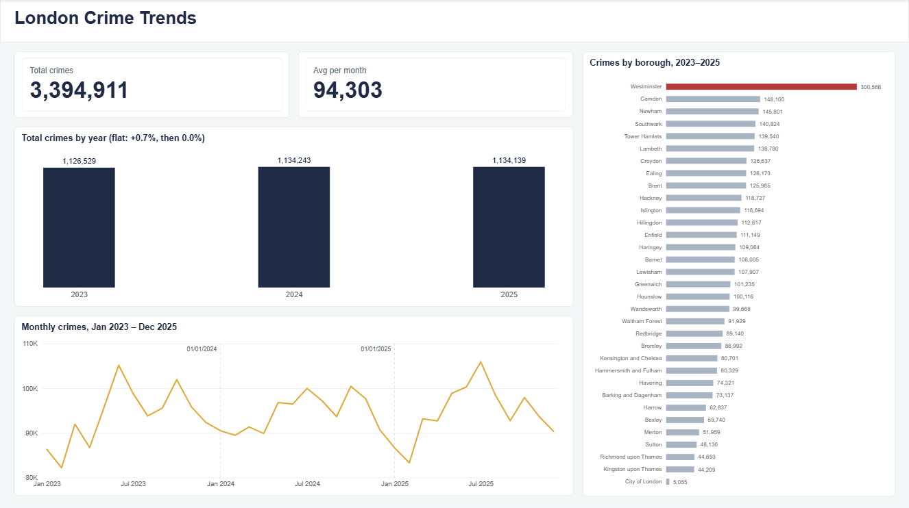
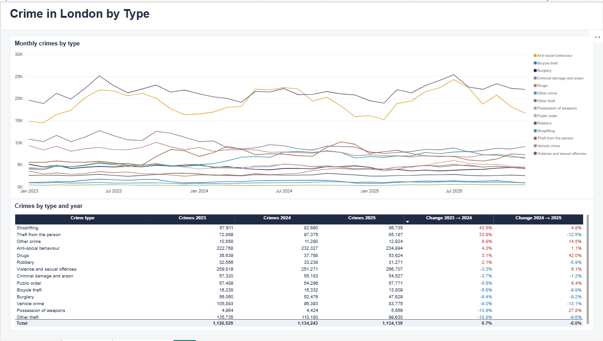

# London Crime Trends, 2023–2025

An analysis of 3.39 million street-level crime records from the Metropolitan Police
Service, January 2023 – December 2025, to see how crime in London changed and where
it happens.

## Business Task

Analyse the trend of crime in London from 2023 to 2025 and answer two questions:

1. What is the trend of crime in London, and where does it happen?
2. How has each type of crime changed from 2023 to 2025?

## Dataset

- **Source:** street-level crime records for the Metropolitan Police Service from
  [data.police.uk](https://data.police.uk/), published under the Open Government Licence v3.0.
- **Coverage:** 36 monthly files, January 2023 – December 2025.
- **Size:** 3,414,776 raw records, 3,394,911 after cleaning.

The raw files are too large for this repository. To reproduce the analysis, download
the Metropolitan Police street-level files for the same months into `data/raw/`.

## Tools

| Tool | Used for |
|---|---|
| Python (pandas) in Jupyter Notebook | Merging and cleaning the 36 monthly files |
| SQL (SQLite, DB Browser) | Counting crimes by borough, month and crime type |
| Power BI | Two-page dashboard |

## Data Cleaning

Steps in [`notebooks/clean_pipeline.ipynb`](notebooks/clean_pipeline.ipynb):

- **Dropped the `Context` column:** it is empty in every row.
- **Kept rows with no `Crime ID`:** all 690,218 of them are anti-social behaviour,
  which the police do not record as individual cases. This is how the source works,
  not an error, so they were not removed or filled in.
- **Added a `Borough` column** from the start of `LSOA name`
  (`"Westminster 013A"` → `Westminster`).
- **Removed 13,509 rows (0.40%) outside London:** crimes near the Met boundary that
  fall in neighbouring counties.
- **Kept 24,151 rows with no location** as `Unknown`. They count towards London totals
  but are left out of borough comparisons.
- **Removed 6,356 duplicate rows**, checking only rows that have a `Crime ID`, so that
  genuine anti-social behaviour records that look alike were not deleted.

The cleaned data was then grouped with [this SQL query](sql/monthly_borough_crime.sql)
into one row per borough, month and crime type (16,723 rows), which feeds the dashboard.

## 1. What is the trend of crime in London, and where does it happen?



- **Total crime was flat over the three years:** 1,126,529 (2023), 1,134,243 (2024)
  and 1,134,139 (2025), about 94,000 crimes a month.
- **Crime is seasonal:** it is lowest in February and peaks in June–July, with a
  second peak in October. February is the lowest month in all three years.
- **Westminster records the most crime** (300,566, about twice Camden in second
  place), likely because of its large number of visitors and commuters. These are
  counts, not rates per resident.
- **Kingston upon Thames records the least** (44,209). City of London appears lower
  (5,055) but is not comparable: it has its own police force, so only a small part
  of its crime appears in Metropolitan Police data.

## 2. How has each type of crime changed from 2023 to 2025?



**2023 → 2024**
- **Shoplifting (+43.5%) and theft from the person (+33.6%) rose sharply**, adding
  about 25,000 crimes each.
- **Other theft fell 18.8%** (−25,555), almost exactly cancelling out the rise in
  shoplifting.

**2024 → 2025**
- **Drug offences jumped 42.0%** (+15,856) after staying flat in 2024 (+3.1%).
  Drug offences are mostly found through police activity, so this may reflect more
  enforcement rather than more drug use.
- **Possession of weapons rose 27.8%** after falling 10.9% the year before. It is a
  small category (5,656 in 2025), so small changes show up as large percentages.
- **Theft from the person reversed, falling 12.5%**, and shoplifting levelled off (+4.9%).
- **Vehicle crime (−13.1%), other theft (−9.6%) and burglary (−9.2%) kept falling**
  for the second year in a row.

**Overall**
- The two largest categories stayed fairly stable: violence and sexual offences
  (−3.3%, then +6.1%) and anti-social behaviour (+4.3%, then +1.1%). Together they
  make up about 43% of all crime.
- **This is why total crime stayed flat:** each year, rises in some crime types were
  cancelled out by falls in others. In 2024, shoplifting and theft from the person
  rose while other theft fell; in 2025, drugs and violence rose while vehicle crime,
  theft from the person and other theft fell.

## Limitations

- **Counts, not rates.** There is no population data, so a high count does not mean a
  higher risk per resident. Westminster draws a large daytime population.
- **Recorded crime, not all crime.** Reporting and police activity affect what is
  recorded, especially for drug and weapon offences.
- **2023 borough figures are slightly low.** About 2% of 2023 records have no location,
  compared with almost none in 2024 and 2025. Totals by year and by crime type are
  not affected.
- **Possible category changes.** The fall in other theft alongside rises in shoplifting
  and theft from the person may partly reflect how offences were categorised, which
  this data cannot confirm.
- **No outside data** (weather, events, policing policy) was used, so the reasons given
  for changes are possible explanations, not proven causes.

## Repository Structure

```
notebooks/clean_pipeline.ipynb   Merge and clean the 36 raw monthly files
sql/monthly_borough_crime.sql    Count crimes by borough, month and crime type
images/                          Dashboard screenshots
dashboard/                       Power BI file
```
